# Animal Detection Pipeline Background Subtraction Project

The aim of this project is to develop a method for generating approximate image segmentations for an animal re-identification pipeline without the use of ground truth segmentaions that can be used for training. The existing animal re-identification process follows the approach outlined in the following paper: https://oar.princeton.edu/jspui/bitstream/88435/pr13m5n/1/Animal_Detection_Pipeline_for_Identification_2018.pdf

This approach follows several steps in order to perform animal image re-identification, that is, identifying a unique individual from an image. These steps include species classification, bounding box localization, orientation detection, background subtraction, and area of interest detection before being passed to the re-identification algorithm. In the paper, the background subtraction step is essentially image segmentation and aims to remove background noise from the image which could confuse models in the downstream task. However, the background subtraction model was trained without ground truth segmentations as such segmentations are very costly to obtain especially given the other annotations required for training: bounding boxes and orientation. The approximate method in the paper of training a model as a classifier, predicting whether or not a region of the image contains any part of the animal or is background noise, works well to remove most of the irrelevant background, but is very approximate and sometimes subtract large parts of the animal.

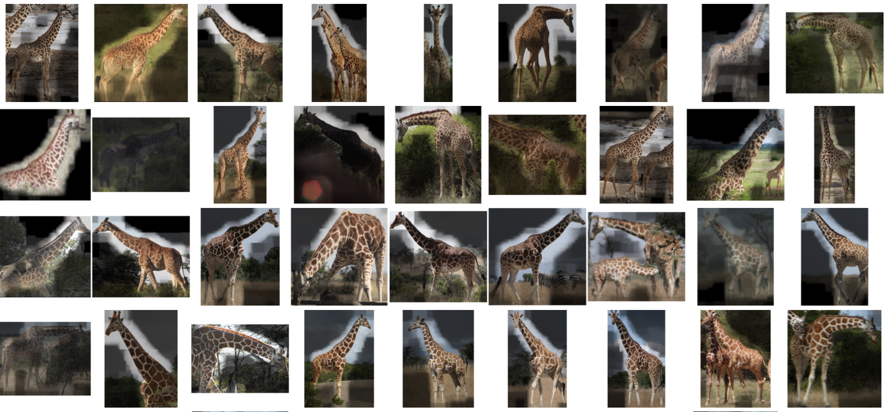

The aim of this project is to develop a method to produce higher quality segmentaions without the need for costly ground truths for training a standard segmentation model.

There are some important aspects to consider in evaluation. First, the recall of a segmentation is generally more important than precision as subtracting a region of the animal may remove information important to identify it whereas adding a region of the background may only potentially add noise to the model. Second, any segmentaion should have a blur applied to it so false negative subtracted regions near the edges may still have a signal.

This project used data from the WILD dataset which has several hundred images of giraffes, zebras, sea turtles and whale flukes with corresponding bounding boxes and orientation labels.

Most of this project used images of giraffes for developing and testing this method. This is because, giraffes' color is relativly close to the background and are often in images with many trees where the noise makes the task a bit more tricky in comparison with other animals for which there is a large dataset such as zebras or elephants. Thus, this offers the opportunity to address these challanges while working with a single animal.

## Methods
---
### **Patch Classification**

While ground truth segmentations to train a segmentation model are not available, bounding boxes can act as noisy labels and offer some valuable signal to train a model to learn the region of the image containing the animal, but has the risk of producing a very rough segmentations as the model is penalized for not highlighting the region within the bounding box, but outside the animal. The key idea is to only provide the model with an NxN patch from the image and train it to predict whether or not the patch is within the bounding box. This idea is shown below.

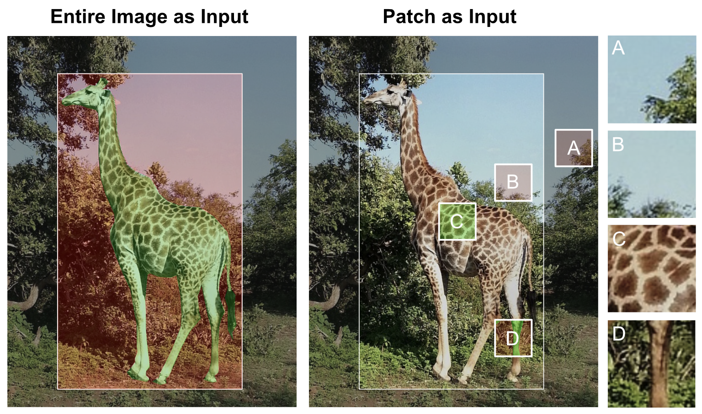

When using the entire image as input, bounding box as an approximate label, and a standard image segmentation model, the model is penalized for not predicting the region in the bounding box, but outside the animal (red). The model will simply learn to output an approximate bounding box and not the desired segmentation. However, only using patches has two benefits:

1. the model cannot learn the region outside the animal, but in the bounding box (red) because in such cases, there is no way to differentiate a patch within the bounding box and a patch outside the bounding box (patch A and B)
    
2. the model is forced to use any signal it can to make the prediction. This forces it to learn features for all parts of the animal (patch C and D).

Dataset Creation:
    
To create the patch dataset, each image is split into patches of size NxN and the patches for asll images are simply combined and shuffled with no differentiation of which patches came from which images.
    
There are two ways to define a label for each patch: the proportion of the patch within the bounding box or simplay a binary label of whether any part of the image is in the bounding box. While the proportion of the image within the bounding box is a more informative signal in terms of probability of an animal region appearing in the patch, it may also add some bias by giving less signal to regions of the animal that tend to be near the border such as the head. This is shown below.

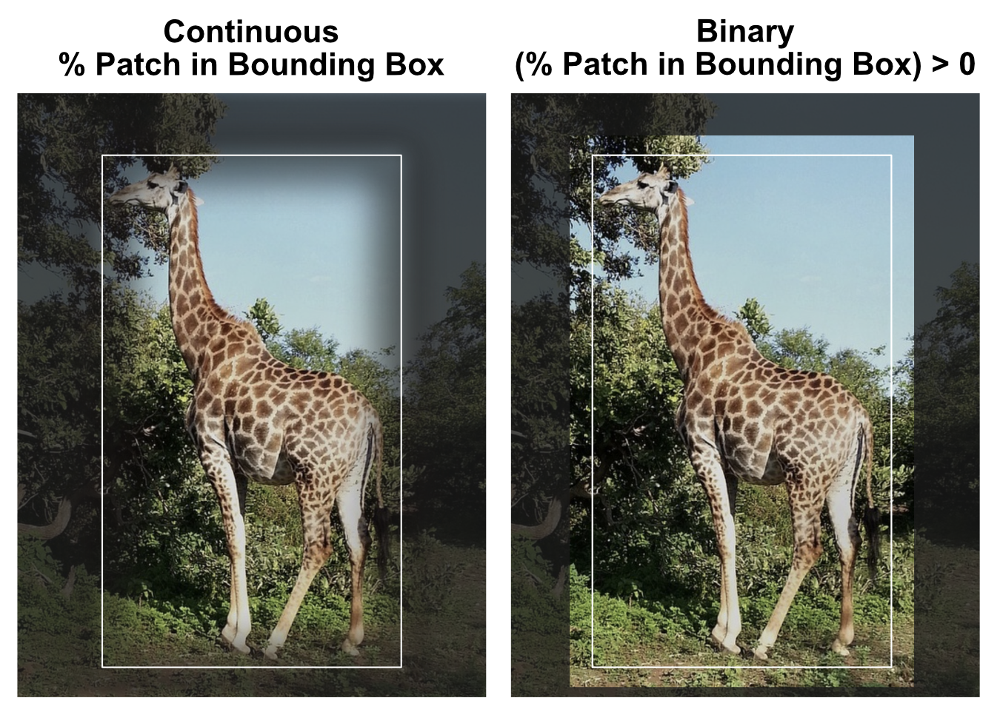

Even in general, it is seen that the patch classifier converges more smoothly and produces better outputs if binary labels are used, that is, whether or not the proportion of the image within the bounding box is greater than zero.

The selected patch size is the most important parameter in the creation of the dataset. Here, there is a tradeoff between the 'precision' of the predicted segmentaion and the feasability of the learning task.
    
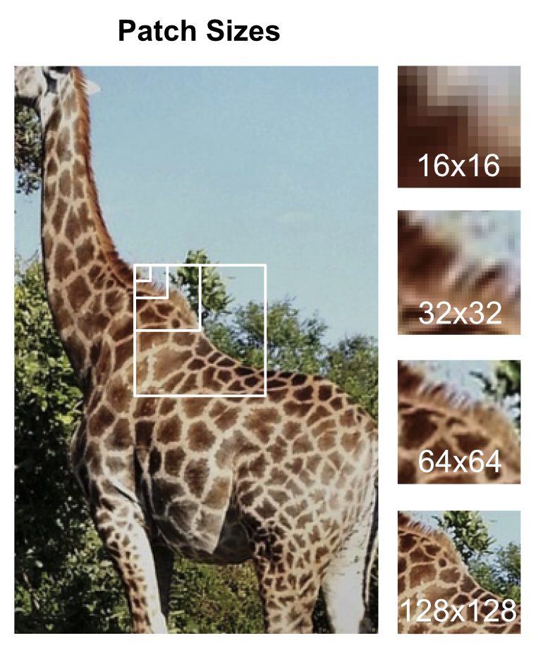

When a patch is very small, the model trained on it is capable of producing a sharper segmentaion, but is limited by the fact that it is more difficult to decide whether a small patch contains a part of the animal. On the other hand, a larger patch will produce a more rough segmentation, but will have more information to make the prediction.

Patch Classifier Model:
    The patch classifier model is a simple convolutional neural network with a set of fully connected layers at the end. It is trained as a binary classifier using binary cross-entropy loss. (how much experimentation done on this?)

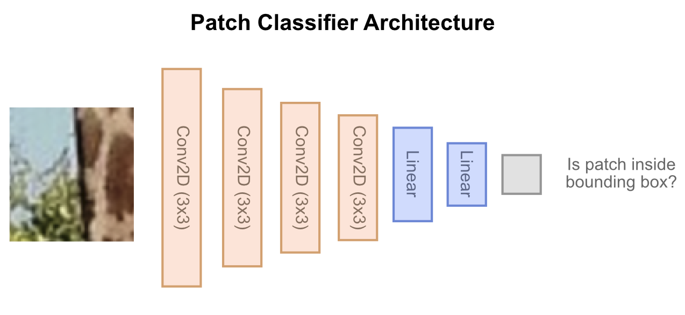

With the trained model, two methods were used to produce approximate segmentations:
    
1. combining intermediate feature activation maps
    
2. Using the patch classifier outputs accross the image to produce a predicted region map

Feature Activation Maps:

The outputs of the intermediate convolutional layers in the patch classifier model will output an activation map where each feature in the model was excited across the image. The feature maps across a layer are then simply averaged togethor to get an approximation of where most of the features were activated.

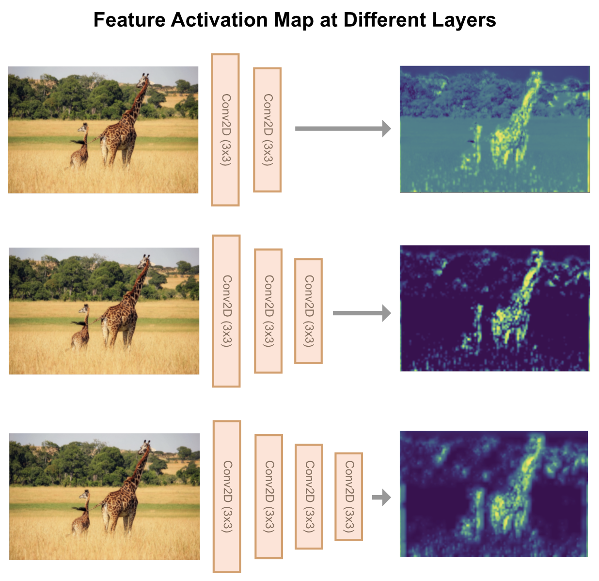

Multiple models trained on different patch sizes are used to generate the feature activation maps and the outputs are simply averaged togethor. With some experimentation on different ways of combining feature activation maps across models and layers, the result of simple average produces results about as good as any method tried. This also helps from the generalizability standpoint as rerunning the models on new animal images may not require more tuning of combination parameters.

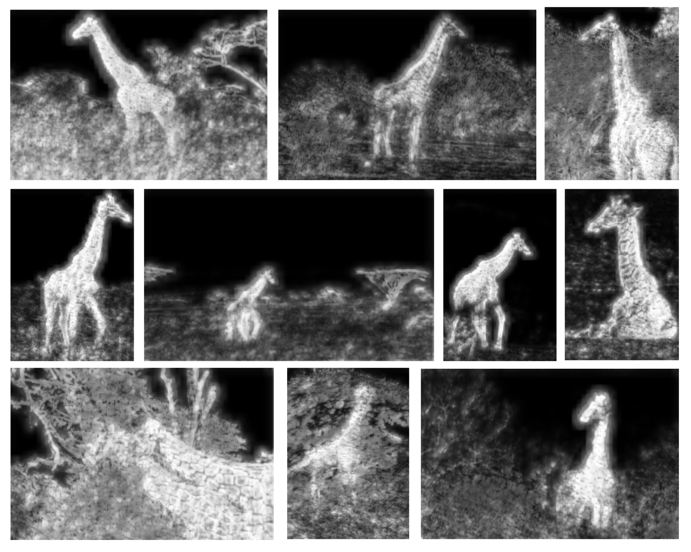

Predicted Regions:

Another method to generate approximate segmentations is to use the output of the patch classifier with patches fed in as a sliding window across the image. Here the full model is used. The results do not differ much from the combination of activation maps, but tend to be smoother, less sharp, but also contain less false positive regions.

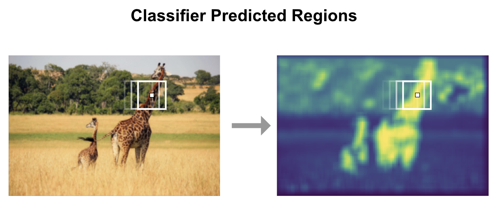
    
From both these methods, the resulting approximate segmentaions do quite well when the animal is in an open area, but are often confused by noise like branches and shrub. In general the combining of the feature activation maps do a slightly better job of highlighting the animal, but tend to be a little more noisy. For most of the later work, the combined feature activation maps are used instead of the predicted regions.

Improving Patch Classification:

This can become an iterative process where another model is trained the exact same way, but instead of using the bounding box, using a high recall version of the predicted segmentation. This way, there will be less noise in this training task and the model learn better to identify animal regions. Some experimentation was does with this, but there was no significant difference in the quality of the new predicted segmentations.

 

### **Image Processing**

With these two approximate activation maps, several simple tricks and image processing methods can be useful for refining these outputs.

Bounding Box Mask:

Given that a predicted bounding box for an image is available, a simple method to remove many false positive predicted region is to use the bounding box as a mask and ignore all predicted regions outside this mask.

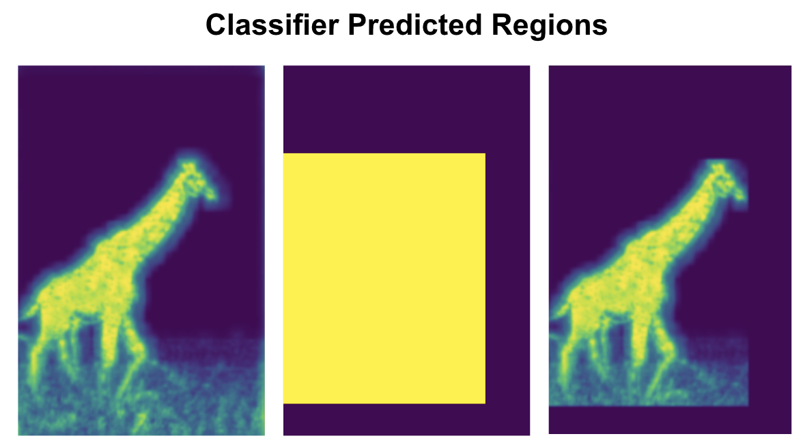
(Find a noiser image to show this)

K-Means Clustering:

K-means clustering is an unsupervised algorithm that can be useful in image processing for to perform unsupervised segmentations. Given a number of clusters, the image will be divided into the specified number of regions. This simple method is used to convert the feature activation maps into a binary image by neatly grouping the highly activated regions into a cluster. In the case of giraffes, using a cluster number of 3 and then only selecting the highest valued cluster produced the sharpest segmentations.

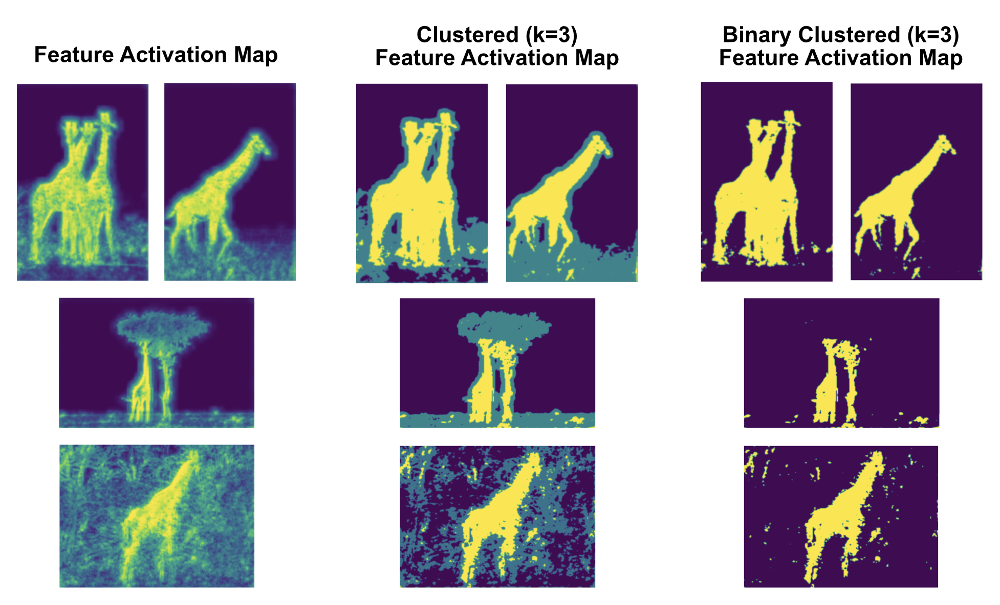

Flood Fill:

A common problem in the original and clustered predicted segmentations that could be a problem for the downstream identification task is that parts of the segmentaion contain gaps or empty regions. This could be a significant problem for downstream tasks as noise in parts of the animal where distinctive patterns appear could confuse the identification model.

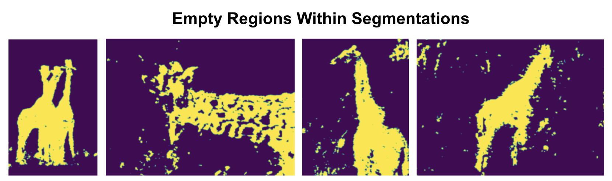

The method used to remove such holes is to apply a flood fill to such regions. This is done by passing the a binary image and position where to apply a flood fill. This approach generally works well to fill most empty regions. It only fails when the empty regions are not fully isolated.

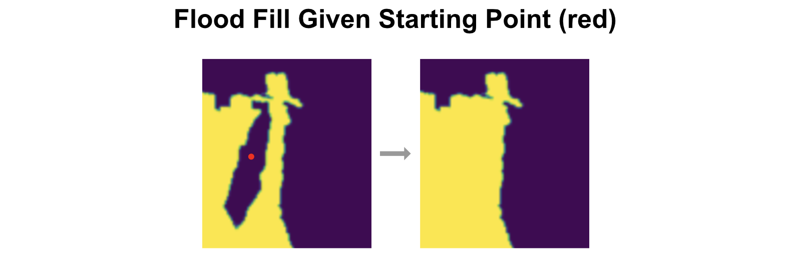

The position of the region to apply the flood fill is not actually required to fill these empty regions. The following steps are used to fill all holes at once:

1. Zero out the border of the image so the flood can be applied all around and doesn't get stuck in any pockets

2. Apply flood fill to the outer part of the image

3. Invert the new image to get the regions to fill

4. Add this new image to the original to get the predicted segmentation to the filled holes.

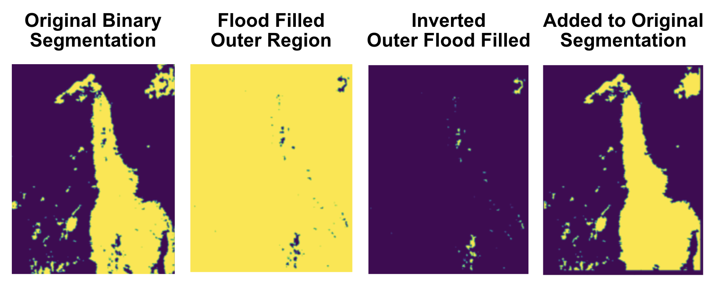

This approach works well in general to remove the empty regions, but tends also to fill regions which are not actually holes, but isolated true negative regions.

To avoid this, large regions to fill after step 3 are removed provided a filter threshold, that is, only regions whose area less than a certain percentage of the original area of the predicted region are filled.

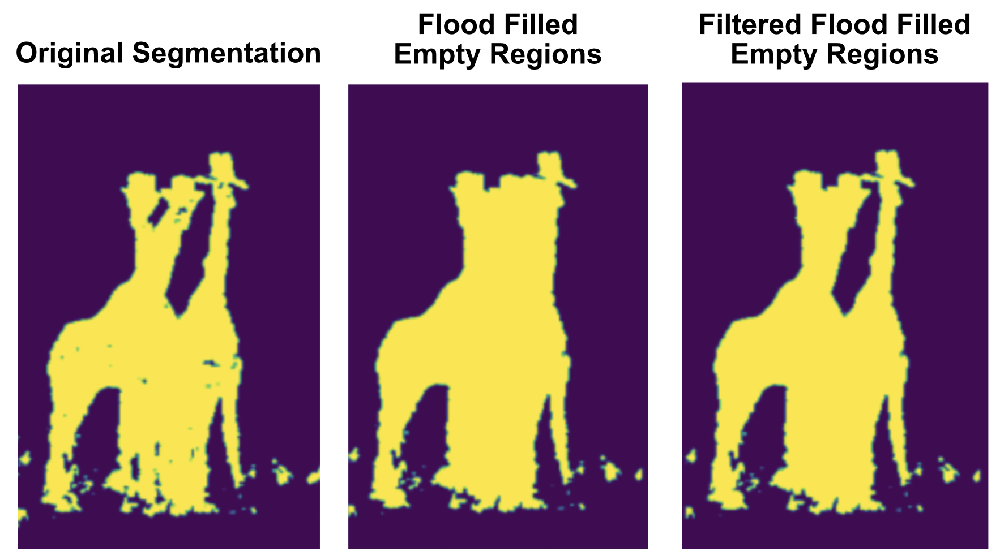

In the above example, any regions >5% of the original predicted segmentation region are not filled.

With this correction, the degree to which the flood fill step makes a mistake is limited to regions of a certain size. For the most part, the segmentations are only improved by this step.

Erosion and Dilation:

Another method experimented with was to apply erosion and dilation operations to the predicted segmentation to "smoothen" the segmentation, that is, remove the empty regions and false positive noise around the predicted segmentation. The erosion operation eats away at the boundaries of a binary image whereas dilation does the opposite. Applying these multiple times one after the other has the effct of filling the small gaps including those that may not have been able to be filled by a flood fill. However, this approach also tends to shift the image if the operation is applied too many times. If applied too few times, it is generally not very useful other than filling small empty regions which is already addressed by the flood fill and so this was not used going forward.

### **Feature Activation Map Denoiser**

In many images, noise from the surrounding regions of the animal makes it difficult to produce a clean segmentation. Some sample of noisy feature activation maps is shown below.

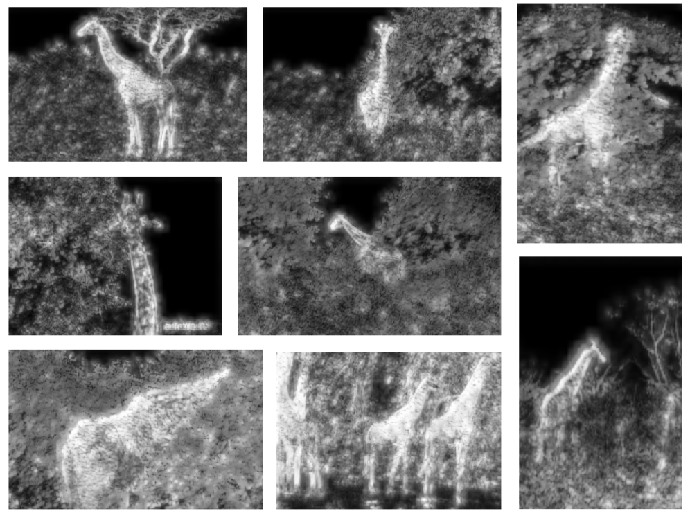

To address this, a denoising model was trained on clean and noisy artificial data. The key idea is that artificial noisy data can be constructed by finding the cleanest predicted segmentations, then sampling noise from the noisiest images and artifically adding it to the clean segmentations to create a clean-noisy image pair. This can then be used to train a denoiser. The steps are as follows:

1. Select the feature activation maps
2. Select the noisiest activation maps
3. Extract noisy patches from the noisy images
4. Generate clean and noisy dataset
5. Augment images to increase dataset size
5. Train denoiser

Clean and Noisy Image Extraction:

The first step is to extract the cleanest activation maps. A score is computed for each activation map and the image is sorted on this criteria. The top N images are selected as the cleanest. Likewise, the lowest scoring N images are selected as the noisiest images. The metric to score each image is defined as:

a * MEAN(act_map * img_mask) - (1 - a) * MEAN(act_map * (1 - img_mask))

This essentially gives a higher score for images where the average value inside the bounding box is significantly higher than the mean value outside the bounding box given a parameter a as the weight for how much the highlighted region inside the bounding box matters relative to the noise outside. When a predicted segmentations highlights a large part of the image inside the bounds and nothing outside, it is given a high score, but if there is a lot of noise outside the image, it will have a lower score.

From the noisy dataset, the parts outside of the bouding box are where patches are sampled from to ensure that not part of the animal is sampled in the noise. Two types of noise are sampled: uniform and structured noise patches. The purpose of sampling the two types of noise sperately is so that the model sees a good mix of different kinds of noise

Uniform Noisy Patch Extraction:

The uniform noise is meant to be static and unstructured noise while the structured noise is meant to capture areas that are confidently confused for parts of the animal. Given a set of noisy patches, the patches are scored by the following metrics:

uniform noise score = gini(mean(patch)) + mean(gini(patch))

structured noise metric = gini(mean(patch)) + mean(-gini(patch))

and the top K patches are from each set selected. A vinnette is added on to the noisy patches so the hard edges do not create confusion when applied to a clean image.

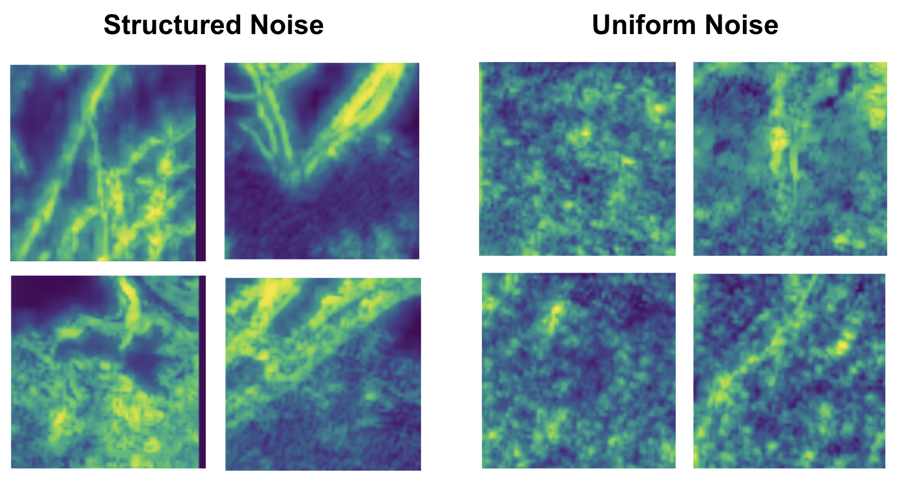

Dataset Generation:

The datset is generated, by first adding the noise patches randomly across the raw feature activation map, then the clean dataset is generated by applying the mask to the original activation map and clustering. A slight blur is applied to the clean images to simplify the training task a bit for the denoiser.

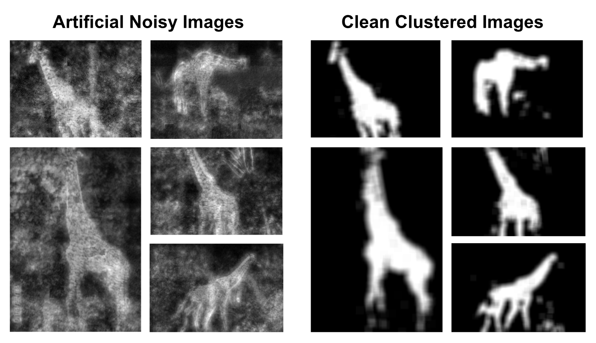

Image Data Augmentation:

Denoiser Model:

The denoiser model is a simple convolutional autoencoder. The aim is for the model to first learn the parts of the image where the animal is by applying convolutions and reducing the field of view and then use the decoder to fill the regions that were predicted to contain the animal.

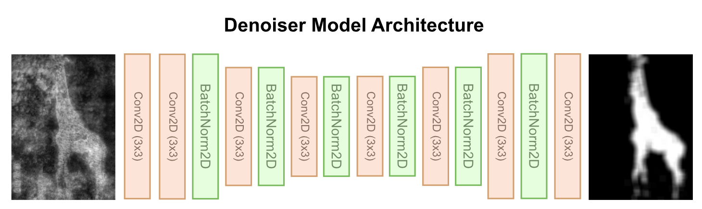

Model Training:

The above described model architecture is simpy then trained to map a batch of noisy images to clean images using mean squared error (MSE) loss. Training is usually terminated after about 30-50 epochs as the model begins to overfit past this point.

Model Evaluation:

To evaluate the strength of the model, the standard image segmentaion metrics can be used (precision, recall, IOU), but the true measure of it's effectiveness will not be reflected on metrics on artificial data. Instead, a set of real noisy feature activation maps are selected and passed through the model and assessed for their quality. If it happens to be the case that the segmentations of artificail images are quite good, but this is not true for the segmentations for the real noisy activation maps, this indicates the generated data is not reflective of the real data. Otherwise it would suggest the model simply needs improvement.

The following are results from the above described data, model, and training method.

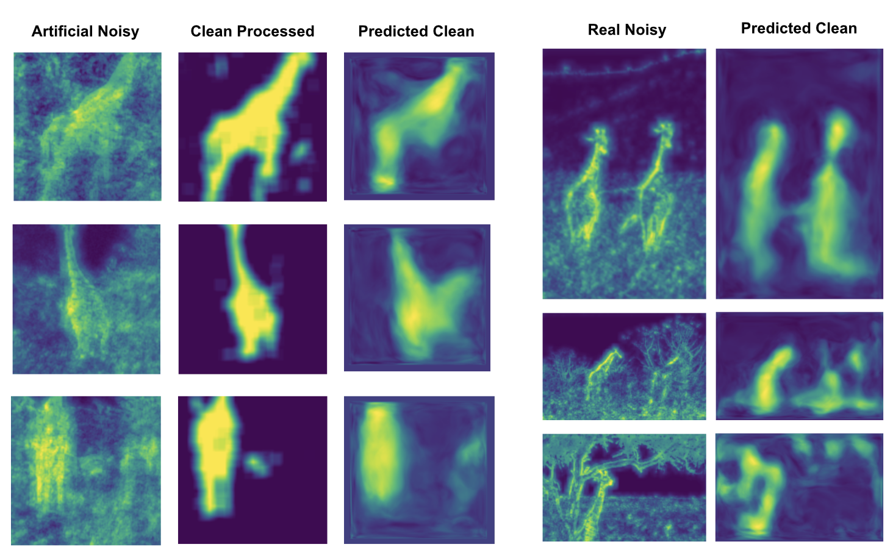

The segmentations are very rough and need improvement, but these would not be the final output. Instead, they would be used to highlight the predicted area of the processed activation map. And so a very rough output would still be useful.

The development for this model and the denoiser training process continues. Some ideas for improvement are discussed below. One simple method would be to try a U-net architecture. A simple skip connection was tried from the start to the end, but using this, the model applied a very minor modification to the original image. The skip connections would be better applied to the middle layers. Furthermore, the method for combining the prediced denoised segmentations with the processed image feature activation maps is another area of exploration that continues.

## Evaluation
---
To evaluate the methods to produce the predicted segmentations, 100 ground truth segmentations were produced and each method was evaluated using precision, recall, and intersection over union (IOU). The combined activation maps with clustering and flood fill algorithms performed best.

| Method | Precision  | Recall  | IOU |
| ------- | --- | --- | --- |
| Raw Feature Activation Maps | 0.12 | 0.68 | 0.12 |
| Masked Feature Activation Maps | 0.23 | 0.68 | 0.23 |
| Predicted Regions | 0.14 | 0.84 | 0.14 |
| Clustered Activation Maps | 0.56 | 0.90 | 0.52 |
| Clustered Filled Activation Maps | 0.62 | 0.84 | 0.55 |

(Update scores with corrected GT)

## Next Steps
---

Generalizability: All methods were developed with a focus on generalizability. The first key next step is to see how well the methods apply to other animals and specifically how much tuning of hyperp-parameters is needed to produce best results across different animals.

Improved Denoiser: The denoiser trained on only feature activation maps as input is limited by the amount of information that is lost when the original image is passed through the patch classifier model. The ability to add artificial noise to the original image may help significantly improve results. And so another potential next step is to sample noise from real images and add it to the original image while using the activation map as a mask for the noise.

Multiple Animal Segmentation: Many images contain multiple animals and all methods described above would only produce a single segmentation. Having a segmentation for each animal would be useful for a more refind background segmentation when there is significant overlap between two individuals and can thus help to avoid sending features from a the wrong individual to the identification model. A similiar approach can be taken to this as with the denoiser. That is, find the cleanest segmentaions and use those to artificially add multiple individuals into one image. Again, the method of doing this must reflect the nature of real images closely to be useful, but the general idea may be valuable to even produce approximate divisions between the full segmentation and offer some useful refinement.
